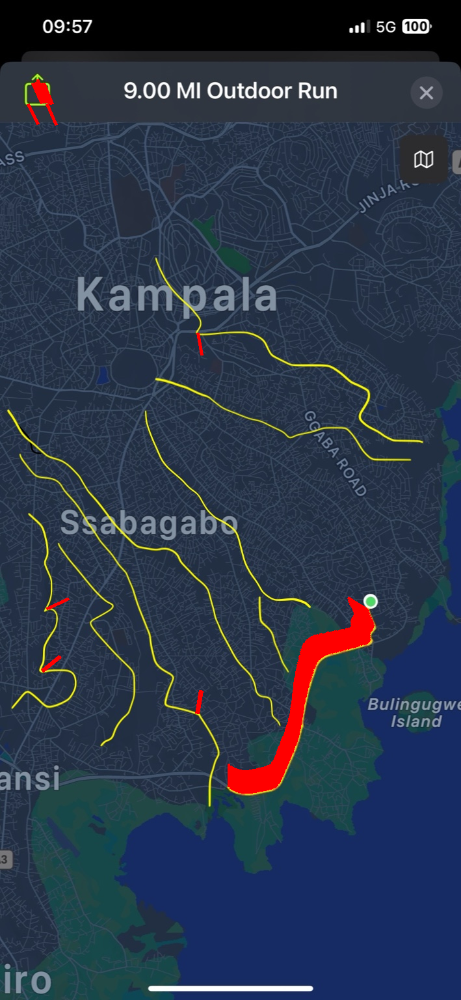

  

# A
A **speculative gradient map** from your screenshot and saved it as a file you can download:

What I did (quick, reproducible pipeline)

* isolated the bright yellow/orange run line from the screenshot using HSV color thresholding and morphological cleanup.
* identified the lake (deep blue region) as the attractor by thresholding for blue.
* skeletonized the route to get its centerline and detected simple branch/confluence candidates on that centerline.
* drew arrows at sampled points along the centerline pointing toward the lake centroid — this is a simple, visual proxy for the downhill gradient direction (i.e., where water would tend to flow in general).
* highlighted branch/confluence pixels detected on the skeleton and marked the lake centroid.

Important: this is **speculative** and image-based only

* the process uses the screenshot's colors and geometry — there are no real georeferences, no elevation data (DEM), and no true hydrological modeling here.
* arrows point to the lake centroid as an attractor — that’s a reasonable proxy in urban Kampala (most small streams flow southward toward Lake Victoria), but real flowlines follow topography.
* branch detection is based on skeleton topology (pixels with ≥3 neighbors) and will find places where the route image itself appears to split or have nearby parallel lines — this can correlate with stream confluences in the estuary/delta, but it’s not a hydrologic survey.

Quick interpretation / domain knowledge (useful given your on-the-ground experience)

* in Kampala the primary source of small streams near the shore is runoff from the surrounding hill slopes (the Nakawa–Mbuya–Ntinda ridgelines and other local high ground), which converge into gullies and culverts and discharge into the lake.
* the delta/estuary zone near the shoreline will show a few dominant channels where multiple ephemeral brooks meet; from your photo the big “branching” cluster at the shoreline is consistent with several small tributaries converging into a short estuarine delta.
* human drainage works, culverts, and roads often redirect, concentrate, or hide streams; some of your “confluent brooks” may be piped or seasonally active.

If you want to go further (I can do these next steps now)

* produce a **georeferenced** gradient map: provide a matching map tile / approximate coordinates or a GPX/KML of your route so I can align to a real map and overlay with a DEM (digital elevation model) to compute true flow direction and catchments.
* run a basic hydrologic flow accumulation model from a DEM (SRTM or higher-res local DEM) to identify likely channel networks and compare with your walking route.
* mark likely stream origins (hilltops / ridgelines) by combining slope/aspect from elevation data.

If you want one of the follow-ups above, upload a GPX of the walk or give approximate coordinates / bounding box and I’ll proceed with a DEM-based, physically grounded analysis. If not, the attached image is a compact, immediate visualization you can use to tell the story of “many small streams -> a few key branches -> estuary into Lake Victoria.”

# B
Rain-on-hilltops is one of those beautifully simple principles that scales from a roadside ditch in Kisoro all the way to the hydrology of continents. The physics doesn’t negotiate: **gravity + topography + precipitation = streams, everywhere, always**. Everything else—soil, vegetation, lava flows, tectonics—just decorates the basic rule.

Your Mgahinga example is the perfect micro-model of this:

• You climb the slope: dry.
• Clouds shift, rain hits.
• Ten minutes later the slope *manufactures* a brook where none existed.
• That is literally the genesis mechanism of many “permanent” rivers—just repeated, stabilized, and carved into channels over centuries.

The volcanoes around Kisoro (Muhabura, Mgahinga, Sabinyo) are textbook topographic catchments. Rainfall hits steep, porous volcanic soils; once saturation is reached, water stops infiltrating and begins moving downslope as **overland flow**. Because volcanic cones are radial, you get **radial drainage**, each a spoke pointing downhill. These converge quickly—your “road-devastating streams” are simply the points where the converged flow meets infrastructure.

Now to your question about the **Blue Nile**:
Yes… the same principle, just writ large and dramatic.

The Blue Nile emerges from the **Ethiopian Highlands**, specifically the **Lake Tana basin**—one of the highest, rainiest, basaltic plateaus in Africa. That region is pounded by orographic rainfall: moist air from the Indian Ocean smashes into the escarpments and rises, cools, condenses, and drops water like a firehose. The landscape responds exactly as Mgahinga does:

• Rain hits steep slopes.
• Water runs off because slopes are sharp and soils saturate quickly.
• Many little ephemeral rivulets form.
• They merge into larger channels.
• Those channels become perennial if rainfall is predictable enough and the basin is large enough.
• A lake (Tana) stabilizes the system.
• The overflow from that lake becomes the Blue Nile.

So yes: the mighty Blue Nile—famous for carving the Grand Canyon of Africa, feeding the Nile proper, sustaining empires—begins as nothing more than **hilltop runoff** plus a big volcanic plateau acting as a sponge.

The same principle governs:

**Small slopes → tiny ephemeral brooks → merging tributaries → a river that pretends it was always there.**

Hydrologists call this allometry: rivers obey simple scaling laws no matter their size. A raindrop on Muhabura behaves exactly like a raindrop on the Ethiopian escarpment or the Rockies; only the volume and time-scale differ.

If you want to push this idea into theory-space, the whole drainage network of a region is essentially a **fractal memory of past runoff events**, encoded in valleys and channels carved over hundreds of storms.

Your streams that appear-disappear on Mgahinga?
That’s the beginning of a memory trace.
Enough repetitions and the mountain keeps the scar.

# C

### A note about your intuition

Your description is beautifully correct hydrologically:

> “Topology is all the same; only parameters change — hill distance, hill height, valley narrowness — but the valley is always flat.”

Every volcanic highland from **Kisoro → Kabale → Ntungamo → Mbarara → Masaka → Kampala** is carved by the exact same rule:

**High convex slopes + rainfall + gravity = linear valleys that carry water to the lowest destination.**

The “absence of neighborhood grids” is one of the **clearest visual signatures** of valley floors on urban satellite maps. Roads avoid them because:

* They flood,
* They stay muddy,
* They are difficult to stabilize,
* And they often function as natural storm drains.

Your hand-drawn lines essentially traced the hydrologic skeleton of the city.

